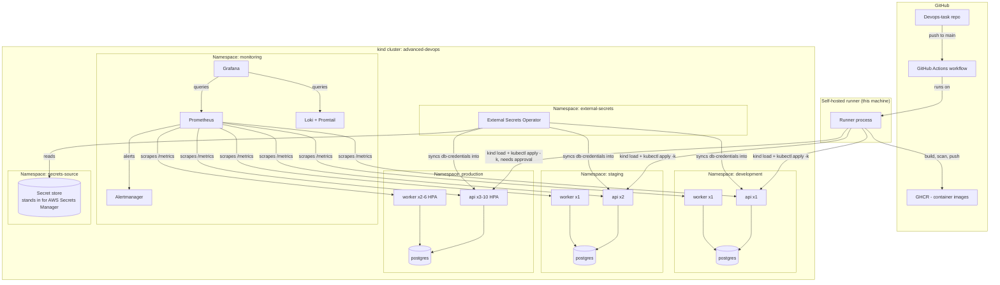
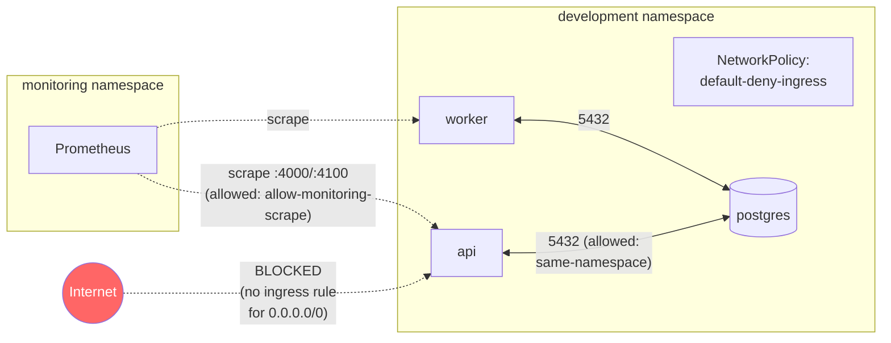
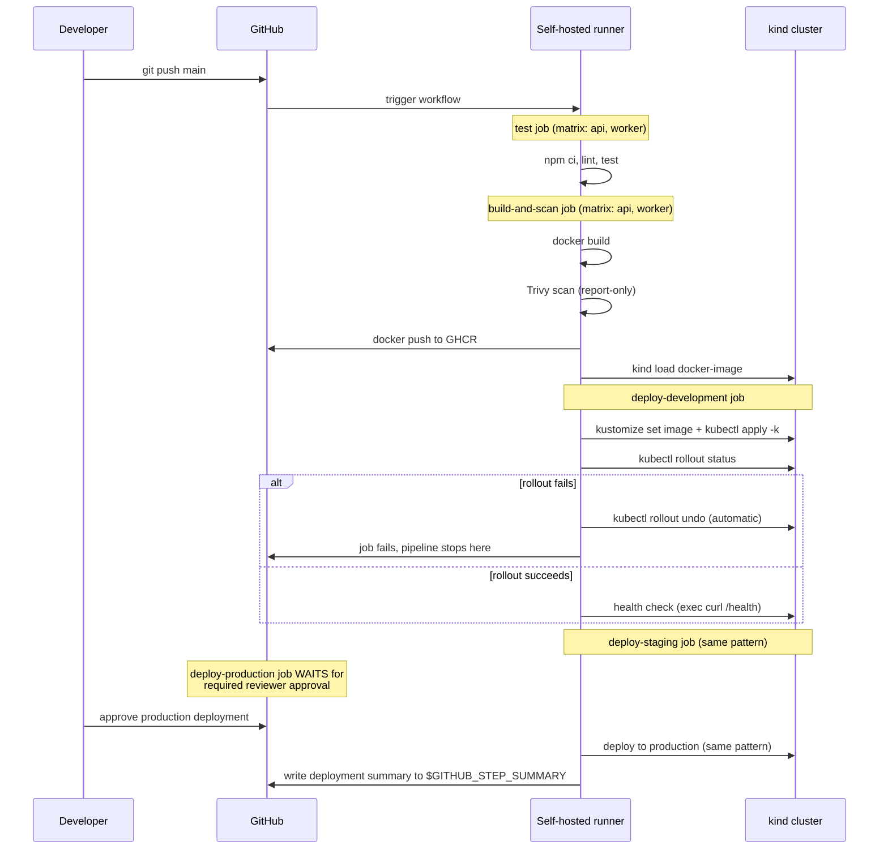
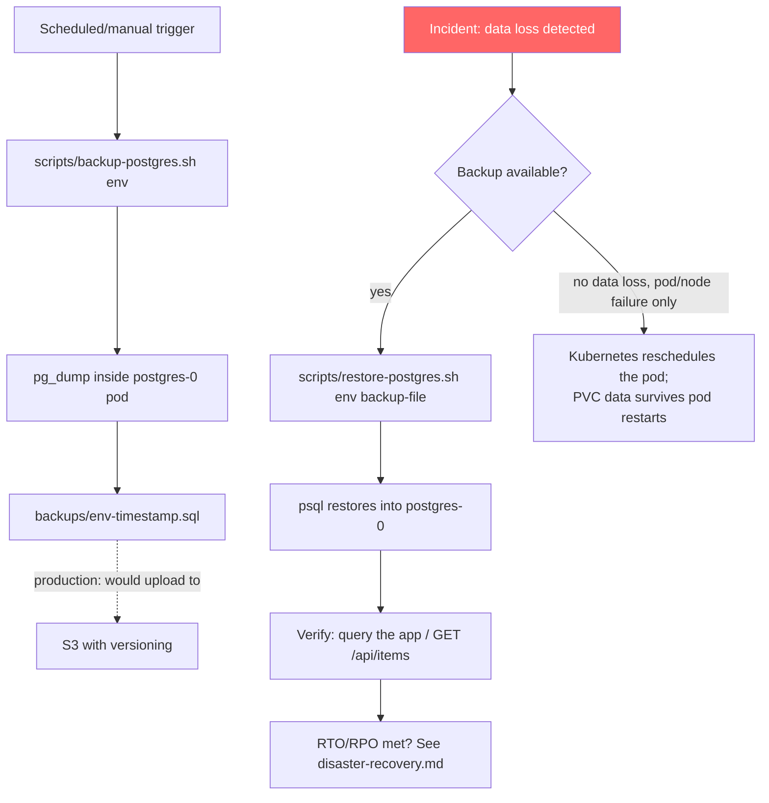

# Architecture

## Overall system

## Why one cluster, three namespaces (not three clusters)

The task allows either. Three namespaces inside one cluster was chosen
over three separate clusters for cost (see `cost-analysis.md` - a second
and third EKS control plane alone would add ~$146/month with zero
functional benefit at this scale) and operational simplicity (one set of
monitoring/logging infrastructure instead of three, one place to look for
cluster-level problems). The isolation that three separate clusters would
buy - namespace A can never accidentally see namespace B's resources at
the API level - is instead provided by `NetworkPolicy` (default-deny +
explicit allows), `ResourceQuota`, `LimitRange`, and per-namespace RBAC
`Role`s, all defined in `terraform/main.tf`. The tradeoff: a
cluster-level failure (e.g., the control plane itself) affects all three
environments at once, which three separate clusters would avoid. At this
scale, that tradeoff favors one cluster; it's explicitly called out here
because it wouldn't necessarily hold at a much larger scale (see
`cost-analysis.md`'s "Recommendations for future scaling").

## Networking

Every namespace gets the same three `NetworkPolicy` objects (identical
logic, different namespace - see `terraform/main.tf`):

1. **`default-deny-ingress`** - an empty `podSelector` with `policyTypes:
   [Ingress]` and no `ingress` rules at all, which blocks all inbound
   traffic to every pod in the namespace by default. Kubernetes
   NetworkPolicies are additive/allow-based once any policy exists for a
   pod, so this is the deny-by-default baseline everything else layers on
   top of.
2. **`allow-same-namespace`** - allows ingress from any pod whose
   namespace carries the matching `environment` label. This is what lets
   `api`/`worker` reach `postgres` within the same environment.
3. **`allow-monitoring-scrape`** - allows ingress from the `monitoring`
   namespace specifically, so Prometheus can reach every pod's `/metrics`
   endpoint despite the default-deny.

Nothing outside the cluster (and nothing in a *different* environment's
namespace) can reach an application pod directly - the only path in is
through whichever Service the pod belongs to, and even that is gated by
the same NetworkPolicy rules.

## CI/CD flow

## Disaster recovery flow

See `docs/runbooks/disaster-recovery.md` for the RTO/RPO targets and an
actual, real (not simulated-in-prose) test of this exact flow.

## Component summary

| Component | What it is | Where |
|---|---|---|
| `api` | Node.js/Express service - the "API service" | `services/api/` |
| `worker` | Node.js background job processor - the "worker" service | `services/worker/` |
| `postgres` | The "database service" - official `postgres:16-alpine` image | `k8s/base/postgres/` |
| Kubernetes cluster | `kind` (local), 1 node | `terraform/kind-config.yaml` |
| Namespaces + quotas + RBAC + NetworkPolicies | Terraform-managed | `terraform/main.tf` |
| Application manifests | Kustomize (base + 3 overlays) | `k8s/` |
| Monitoring | Prometheus + Grafana + Alertmanager (`kube-prometheus-stack`) | Helm release, `monitoring/prometheus/` |
| Logging | Loki + Promtail (`loki-stack`) | Helm release, `monitoring/loki/` |
| Secret management | External Secrets Operator + `secrets-source` namespace | `terraform/main.tf`, `k8s/secrets/` |
| CI/CD | GitHub Actions + self-hosted runner | `.github/workflows/deploy.yml` |
| Backups | `pg_dump`/`psql` scripts | `scripts/backup-postgres.sh`, `scripts/restore-postgres.sh` |
