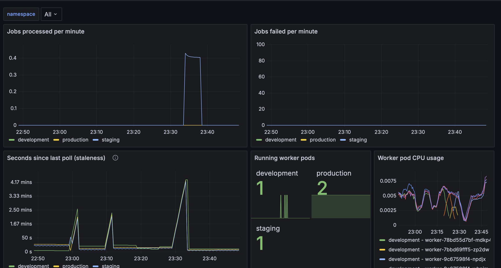
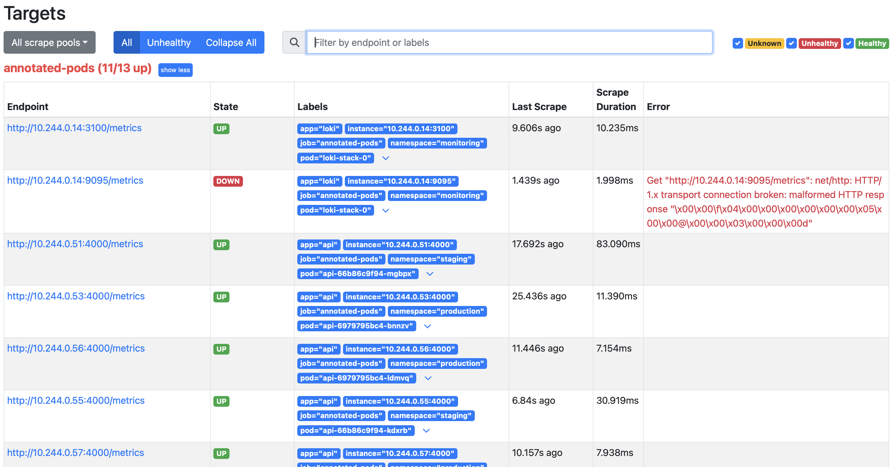
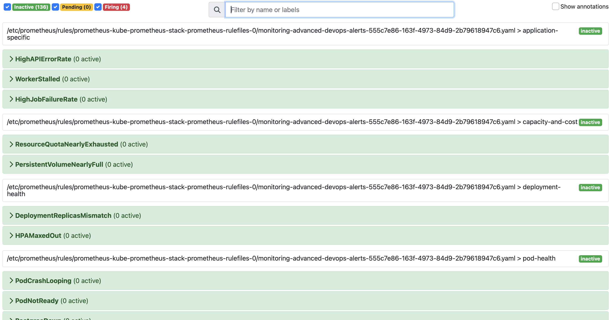
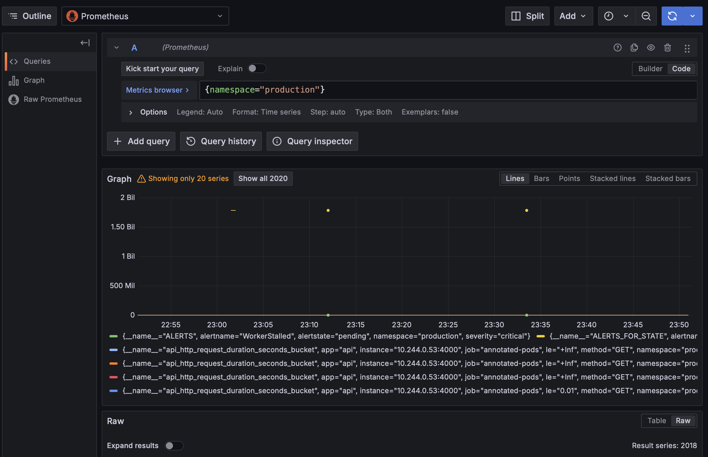
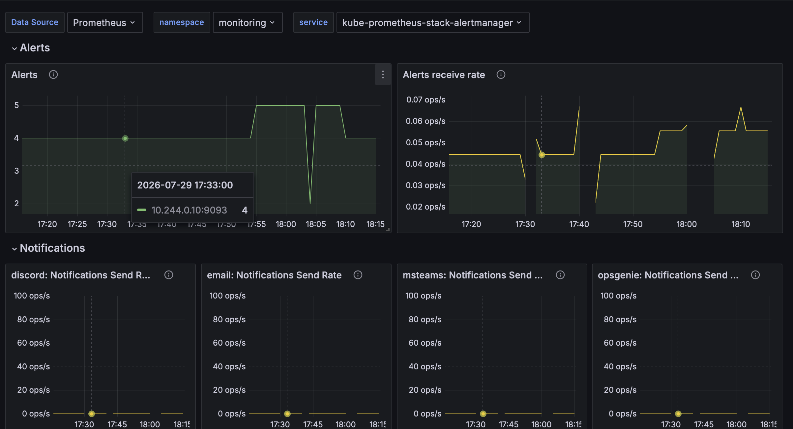
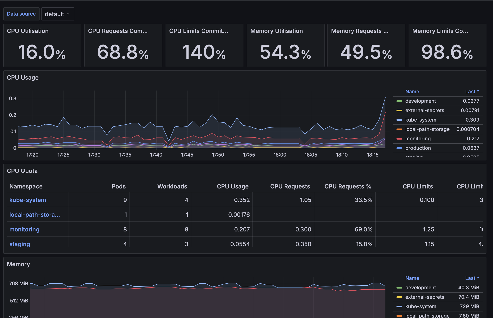
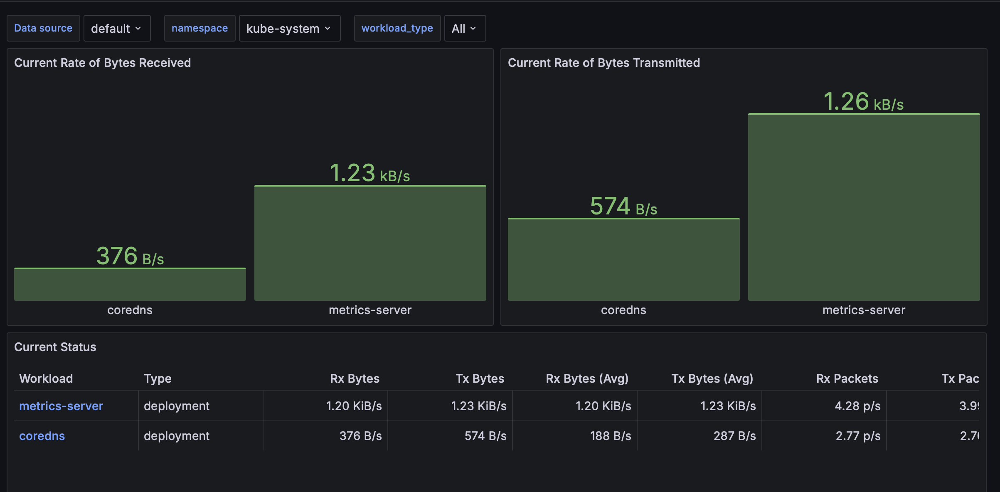
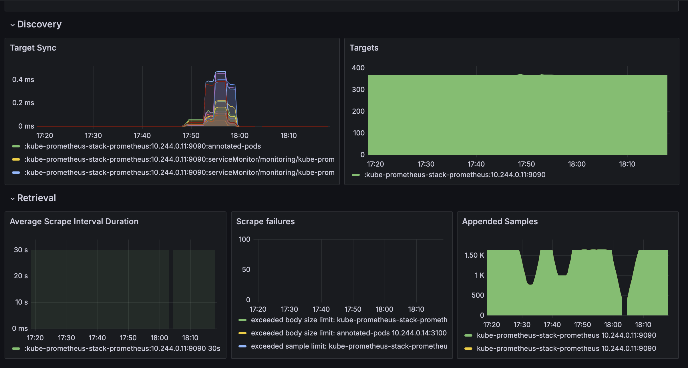
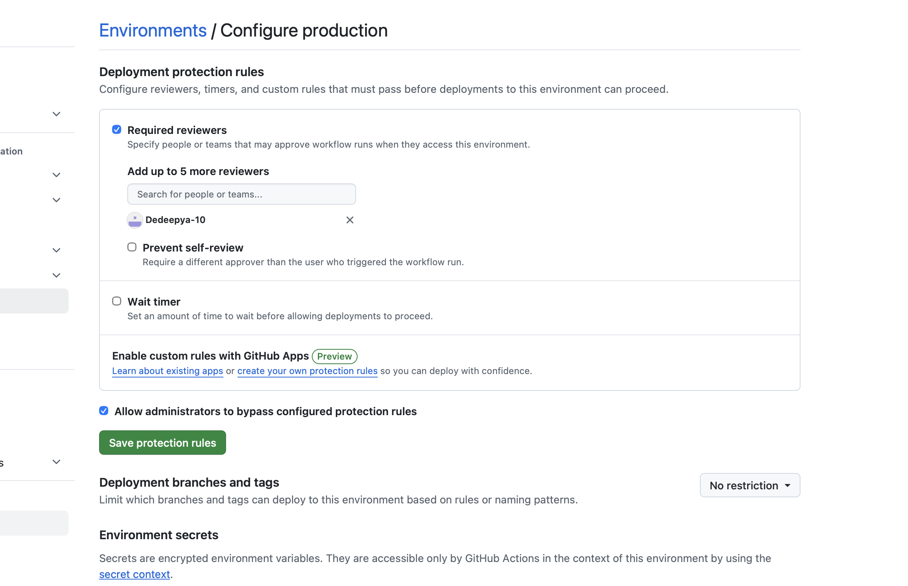

# Monitoring Evidence

Real screenshots taken against the running cluster (not mocked), while all
three environments, the monitoring stack, and External Secrets Operator
were up simultaneously. See `docs/cluster-state-evidence.md` for the
corresponding `kubectl` output at the same point in time.

## Custom dashboard: Worker Service Overview

One of the 5 custom Grafana dashboards
(`monitoring/grafana/dashboards/02-worker-service.json`), showing real
data: jobs-processed rate, poll staleness, and running worker pod counts
per namespace matching the actual replica counts (development=1,
staging=1, production=2).

## Prometheus targets

`Status → Targets` showing the `annotated-pods` scrape job (the custom
`additionalScrapeConfigs` block in `monitoring/prometheus/values.yaml.tpl`
that scrapes `api`/`worker` pods via their `prometheus.io/scrape`
annotations, across all three namespaces) — 11/13 up. The one `DOWN`
target is Loki's internal gRPC port (9095) being incidentally matched by
the same annotation-based scrape rule; Loki's actual metrics port (3100)
is healthy, so this doesn't affect anything functional.

## Prometheus alert rules

All 12 custom alert rules (`monitoring/prometheus/alert-rules.yaml`)
loaded and evaluating cleanly — every one shown `inactive`, meaning no
false positives at baseline load.

## Grafana Explore — alert state during a rollout

Querying `{namespace="production"}` directly against the Prometheus
datasource in Grafana's Explore view. This particular capture happened to
show `WorkerStalled` briefly enter `pending` state (not `firing` — it
requires 2 minutes sustained per the rule's `for:` clause) during a
worker pod rollout, which is exactly the kind of transient signal the
alert is designed to catch without over-firing on a normal, brief
restart.

## Bundled dashboards (come with kube-prometheus-stack by default)

Beyond the 5 custom dashboards, the Helm chart also provisions a set of
well-established community dashboards for free, which were used throughout
this build to sanity-check cluster-wide behavior:

**Alertmanager Overview** — confirms the alerting pipeline itself is
alive (notification send rates, active alert count):

**Kubernetes / Compute Resources / Cluster** — per-namespace CPU/memory
usage against quota, the same underlying data our custom "Namespace
Resource Quotas" dashboard and `docs/cost-analysis.md`'s utilization
section are built from:

**Kubernetes / Networking** — network throughput by workload, useful for
confirming the NetworkPolicy setup isn't silently dropping traffic it
shouldn't be:

**Prometheus / Overview** — Prometheus's own health: ~370 scrape targets,
zero scrape failures, healthy target sync:

## Production deployment approval gate

GitHub's environment protection rules, configured on the `production`
environment with `Dedeepya-10` as a required reviewer — this is the
mechanism enforcing "separate deployment approvals for production," not
custom pipeline code.

